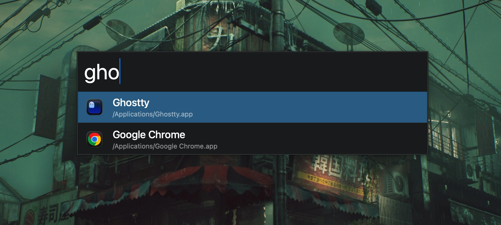

# Cockpit

Cockpit is a local macOS launcher for opening applications and deliberately indexed filenames without Spotlight.

## Build and install

Cockpit requires macOS 13 or later and Xcode 15 or later. Build and run a development copy with:

```sh
swift test
swift run Cockpit
```

To build a release executable and install it as an unsigned local app in `~/Applications`:

```sh
Scripts/install-local.sh
```

Pass another app-bundle path to install elsewhere, for example:

```sh
sudo Scripts/install-local.sh /Applications/Cockpit.app
```

Press **Option-Space** to show the Launcher by default. Use Cockpit’s menu-bar icon to choose **Settings…** and select **Ctrl+Space**, **Alt+Space**, or **Cmd+Space**, or to show or quit the app. Cockpit searches the standard application locations (`/Applications`, `/System/Applications`, and `~/Applications`) without Spotlight, alongside Lock, Restart, and Shut Down System actions. Select a result and press Return to open the application or run the System action. The menu-bar menu also provides an opt-in Launch at Login control; “Approval Needed” leaves macOS’s setting unchanged.

## Performance acceptance benchmarks

On an Apple-silicon Mac, run the repeatable 50,000-item fixture benchmark with:

```sh
COCKPIT_RUN_BENCHMARKS=1 swift test --filter PerformanceBenchmarks
```

It verifies the documented p95 hotkey and p95/p99 ranked-query targets. Filesystem freshness is covered by the filename-index change-event integration checks.

## Direct release

`Scripts/release.sh <version>` builds a hardened-runtime Developer ID app, submits it for notarization, staples the result, and emits a distributable zip. It requires `DEVELOPER_ID_APPLICATION` and `NOTARY_PROFILE`; the release bundle contains no entitlements or privileged helpers.
